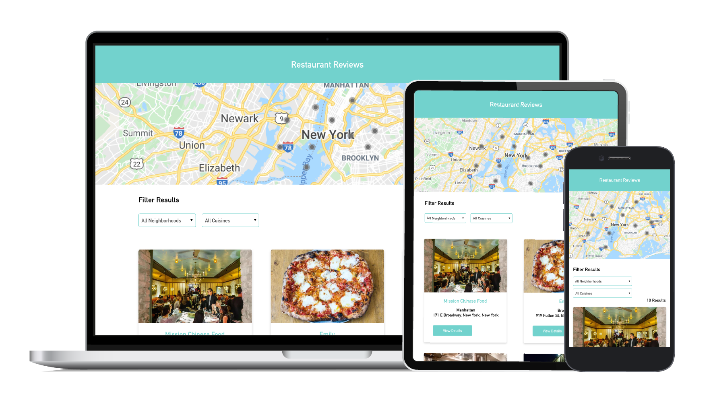

# Mobile Web Specialist Certification Course

## Project Overview 

Restaurant Reviews is a responsive, offline first, progressive web application (PWA), done for the Udacity Mobile Web Specialist Nanodegree as part of the Google Developer Scholarship program.

### Challenge
>Leverage front end web patterns & APIs, such as service workers to convert a static web page into a mobile-ready web application, allowing users to look up restaurants in the New York area and view additional information about a selected restaurant.
>Any data previously accessed by the user whilst connected is reachable while offline.
>A user must also be able to leave a review and add a restaurant to their list of favourites both online and offline.  

>The application must achieve a lighthouse score > 90.

### Approach
In order to achieve a lighthouse score > 90,  4 main areas were worked on:
1. Responsive Design
2. Accessibility
3. Application Data & Offline Use
4. Performance

#### Responsive Design 
In order to ensure the application UI is compatible with a range of display sizes the following were implemented:
1. A wide range of media queries has been adopted to support devices of different viewport sizes influenced by the most common phone, tablet and mobile breakpoints. 
2. CSS Flexbox has been utilised to help adapt screen layouts to different viewport sizes and orientations.
3. Image sizes are responsive and rendered based on viewport size.

#### Accessibility
In order to achieve a suitable level of accessibility, which would enable screen reader use and follow where possible the Web Content Accessibility Guidelines (WCAG) the following features have been implemented: 
1. Appropriate focus management for navigation 
2. Logical tabbing 
3. Appropriate HTML semantics
4. Aria roles defined where applicable
5. Alt text added to all images

#### Application Data & Offline Use 
In order convert the static page to a dynamic one and ensure the best user experience in areas of poor connectivity the following approach has been implemented:
1. The application has been refactored to use the Fetch API to pull restaurant data from a locally hosted development server, parsing the JSON response and rendering it in the appropriate UI.
2. JSON responses are cached locally in the browser using the IndexedDB API. Any data previously accessed while connected is now reachable while offline.
4. A service worker is registered and activated to cache responses to requests for site assets enabling the rendering of pages when there is no network access.
5. To enable users the ability to add a review to a restaurant while offline, reviews are first stored locally in the IDB, before being sent to the server. This ensures that the review can be viewed immediately after it has been submitted by pulling the reviews list from the indexed DB, even when a user is of
 offline. When connectivity is re-established the review is sent to the sever. 
 
#### Performance
To improve the performance of the app and reduce loading time IntersectionObserver has been used to apply a lazy loading approach to the rendering of images across the application.

### Install & Run
1. Clone this repository
2. Add a Google Maps API Key
> As displaying the location of each restaurant on a map is a feature of this project you will to supply an Google Maps JavasScript API key in both the index.html and the restaurant.html files.
> For more information on how to do this please follow the instructions provided [here](https://developers.google.com/maps/documentation/javascript/get-api-key).
3. With your API keys added, in this folder, start up a simple HTTP server to serve up the site files on your local computer. Python has some simple tools to do this, and you don't even need to know Python. For most people, it's already installed on your computer. 
In a terminal, check the version of Python you have: `python -V`. If you have Python 2.x, spin up the server with `python -m SimpleHTTPServer 8000` (or some other port, if port 8000 is already in use.) For Python 3.x, you can use `python3 -m http.server 8000`. If you don't have Python installed, navigate to Python's [website](https://www.python.org/) to download and install the software.
4. With your server running, visit the site: `http://localhost:8000`, and look around for a bit to see what the current experience looks like.

### Serving Data
The data for this application has been provided by Udacity. 
In order to serve the data for the application please follow the instructions found [here](https://github.com/udacity/mws-restaurant-stage-2).
The port this runs in should match the path found in the IDB helper. Ensure these match, if not update the patch in the IDB helper to match that of the port hosting the server.

